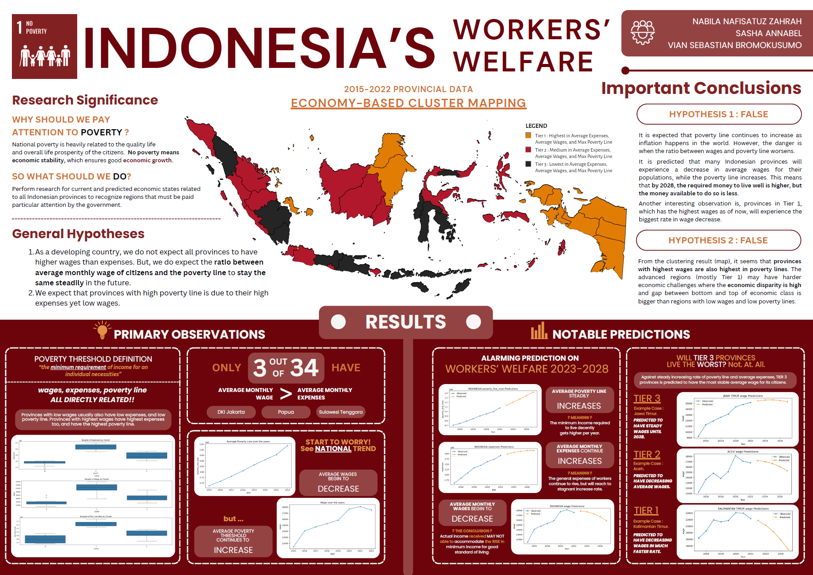

# Trend Analysis for Indonesia's Workers' Welfare Assessment

### ABOUT

This project intends to display predictions of national wages and poverty lines for the next few years, including tiered categorization of provinces based on their economic states. 

The project aims to provide answers to previously determined hypotheses, and present supporting evidence to any given claims. 
 

### PROCESS OF DATA ANALYSIS AND MACHINE LEARNING

As a team project, detailed outline of technical process can be read in [data-prediction-report.pdf](data-prediction-report.pdf). Overall, the research methods can be simplified as follows:
| Process | Description | Outcome |
| --- | --- | --- |
| Data Acquisition | From Kaggle, containing information from the official site of Badan Pusat Statistik Indonesia (Central Bureau of Statistics Indonesia) | Data on Poverty Line, Expenses, Minimum Wage, and Wage in CSV format were available to use. |
| Data Pre-Processing | Filtering and re-formatting data to match desired training purpose. | Key columns (Expenses and Poverty Line) are altered. |
| Exploratory Data Analysis | Generation of linear trends, pairplot visualizations, and correlation matrix for data understanding. | Every column (data feature) has high correlation with one another. |
| Clustering | Observation of data point plots density (three-dimensional for three features; Expenses, Wage, and Maximum Poverty Line) and K-Means Clustering implementation to group the provinces most suitably. | Now, each province are now grouped into three separate economic tiers. |
| Regression | Application of polynomial regression to capture intricate and nonlinear relationship between features. | There is predicted national trends (irrespective of provinicial tiers) on key data features. |
 

### PROCESS OF DATA ANALYSIS AND MACHINE LEARNING

To observe the summarized synthesis of our assessment, do read the infographic below.
 

